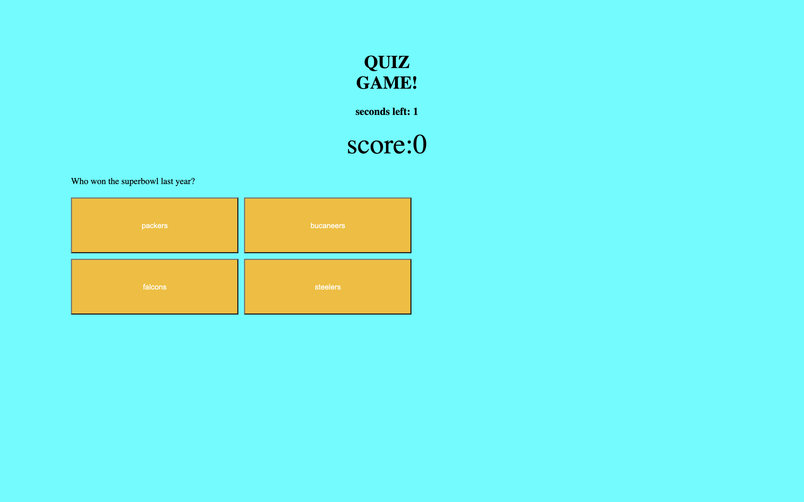

# batista-quiz-game
## Description
This project is a quiz app in which you get a series of questions and if you get it correctly you go on to the next qeustion if you answer it incorrectly then you time goes down 10 seconds. if the time runs out and you havent finished the quiz you lose, if you finish the quiz and still have time left the time thats left is your score.

## Installation
 you can clone code from repository in github link and bring it down to your local drive. From thier you can use visual studio code as your ide or any other is fine.then open in browser.
## Usage
 clone the repo from  you can use visual studio code as ide then open in google chrome or any browser.
 

## License
MIT License

Copyright (c) [2021] [john batista]

Permission is hereby granted, free of charge, to any person obtaining a copy
of this software and associated documentation files (the "Software"), to deal
in the Software without restriction, including without limitation the rights
to use, copy, modify, merge, publish, distribute, sublicense, and/or sell
copies of the Software, and to permit persons to whom the Software is
furnished to do so, subject to the following conditions:

The above copyright notice and this permission notice shall be included in all
copies or substantial portions of the Software.

THE SOFTWARE IS PROVIDED "AS IS", WITHOUT WARRANTY OF ANY KIND, EXPRESS OR
IMPLIED, INCLUDING BUT NOT LIMITED TO THE WARRANTIES OF MERCHANTABILITY,
FITNESS FOR A PARTICULAR PURPOSE AND NONINFRINGEMENT. IN NO EVENT SHALL THE
AUTHORS OR COPYRIGHT HOLDERS BE LIABLE FOR ANY CLAIM, DAMAGES OR OTHER
LIABILITY, WHETHER IN AN ACTION OF CONTRACT, TORT OR OTHERWISE, ARISING FROM,
OUT OF OR IN CONNECTION WITH THE SOFTWARE OR THE USE OR OTHER DEALINGS IN THE
SOFTWARE.
